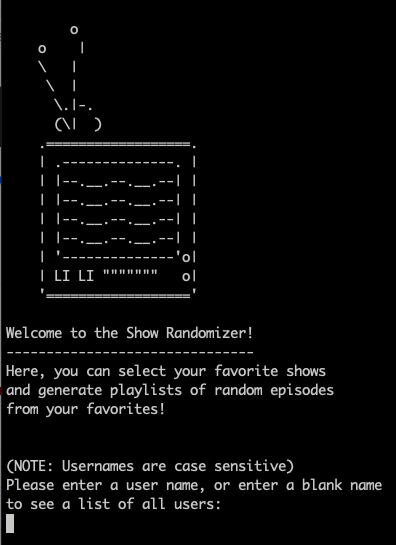

# Show Randomizer

The Show Randomizer is a Ruby-based CLI program that helps users browse a database of tv shows, keep track of their favorite ones, and generate a random list of 10 episodes from their favorite shows. Stop wasting time trying to decide what show or episode to watch and let the Show Randomizer decide for you!

Data provided by [EpisoDate.com](https://www.episodate.com/)

## Installation
* Make sure Ruby is installed
* Fork the repository from https://github.com/isalevine/module-one-final-project-guidelines-seattle-web-career-021819
* Clone the repository with
`git clone https://github.com/isalevine/module-one-final-project-guidelines-seattle-web-career-021819`
* Navigate to the folder with `cd module-one-final-project-guidelines-seattle-web-career-021819`
* Run bundle install `bundle install`
* Create the required tables `rake db:migrate`
* Run the program `rake run`

## Navigating the Program
The menus in this program are generally navigated by entering a number from the menu presented. However, keywords and abbreviations (and some synonyms!) for many words will also work.

For example, a menu with option "1. Search shows by title" can be selected by entering any of the following: '1', 's', 'se', 'sea', 'sear', 'search', 'h', 'sh', 'show', 'shows', 't', 'ti', or 'title'

(Note: For menus where some keywords or abbreviations overlap, only the first match found in the menu will be executed.)

Many menus also take time to load--please be patient, and do not press Enter again until the menu loads. (This will potentially cause a crash--feedback and proposed fixes are welcome!)

## Features
These are the key features and functionality built into the program:
* Search for TV shows by title--searches also return potential matches, which are then selected by ID number
* Add/remove TV shows to/from your Favorites list
* Generate playlists of episodes from your Favorites list--episodes are chosen and ordered randomly, and you can specify how many episodes to add!
* View and update your user profile:
  * Change your user name
  * Add your real name (optional)
  * Toggle on/off which shows from your Favorites list are added to playlists
  * See statistics on your favorite shows and playlists
* View program statistics drawn from all users

## Demo

## Contributing
Contributions are welcome in all shapes and forms, especially bug fixes and feature additions.
To contribute, please fork the repository and create a separate branch that you can then commit and push.
Thank you!

## Next Steps
- [ ] User Profile page showing statistics
  - List of start dates for user's favorite shows
  - Which network does a user favorite the most?
  - What shows are most favorited?
  - Upload profile pic and convert to ASCII art

## Credits
A project by [Isa Levine](https://github.com/isalevine) and [Yutaro Tsuji](https://github.com/ytsuji27)

Welcome Page TV ASCII art taken from: https://www.asciiart.eu/electronics/televisions

Gems Used:
source "https://rubygems.org"

* gem "sinatra-activerecord"
* gem "rest-client"
* gem "sqlite3"
* gem "json"
* gem "bundler"
* gem "i18n", "=0.8.1"
* gem "pry"
* gem "require_all"
